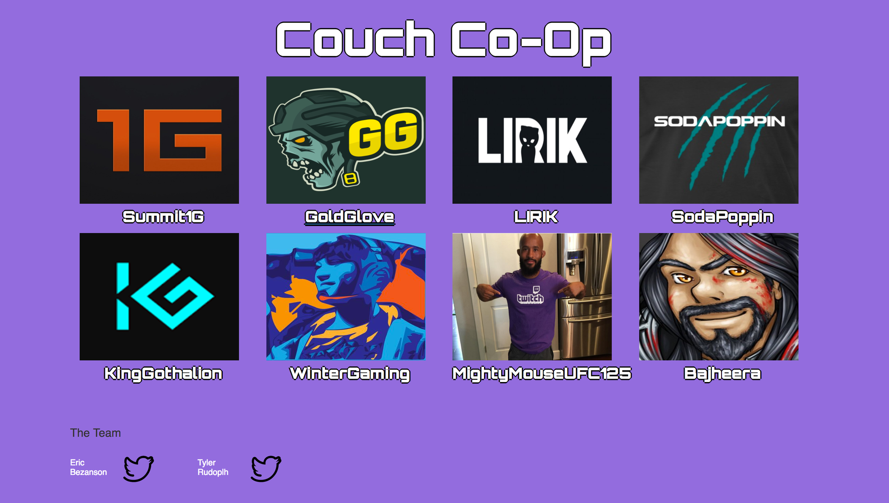

# Couch-CoOp

## Installation
####In Browser
for quick access to the app visit this <a href="https://polar-depths-67065.herokuapp.com/#/streams">Link</a>
####Local
To run the app locally you will need to use a local server, I suggest installing <a href="https://www.mamp.info/en/">MAMP</a> and while in the console navigate to the htdocs folder within MAMP and run: <pre>git clone https://github.com/ericbezanson/Couch-CoOp.git</pre>
######(note: MAMP is just a personal suggestion, any local server will do)

##Functionality
<a href="https://www.twitch.tv/">Twitch.tv</a> is one of the most used sites in on the web and provides a wide variety of entertainmet to the many video game fans around the world. However, when watching a popular stream the comments section is kind of insane... With upwards of 100 thousand people all commenting at once it can be hard to carry a discussion or ensure that any friends you may be watching the stream with see what you write.

With Couch-CoOp we aim to provide a way to watch a twitch stream in a private lobby with your friends and be able to comment with other users who are watching in the same lobby. Think Going from having a conversation outside the auction house in orgrammar In Warcraft to having a conversation while playing split screen Goldeneye.

##How it Works

the Data for each stream is stored locally in a data.json file. The streams.js service then grabs that data via http.get request inside an angular factory. That service is injected to the dependancy array of the HomeController and then fed to the home view which lays out the channel selection.

Upon clicking on a channel you are brought to the stream view which is contructed by the StreamController. You selected broadcast will begin to play thanks to the Twitch API. A custom angular filter is used to ensure the URL is trusted as it is being injected into an iframe from a non-local source. 

